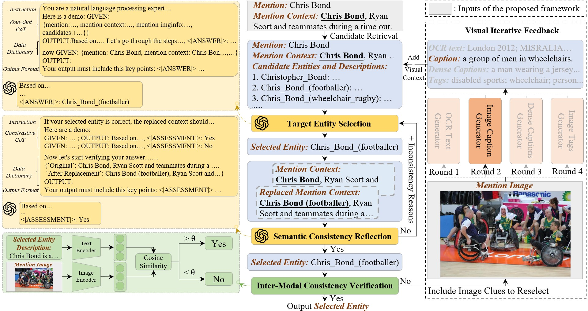

# SMCR
This is the official github repository for the paper "Integrating Large Language Models in Multimodal Entity Linking: A Novel Two-Level Reflection Framework".

Download all code and data: [SMCR_all.zip](https://drive.google.com/drive/folders/1TN_-nUqfv8V9nIPVT1O_vgoE4pNEnkgh?usp=sharing)

## Contents
- [SMCR](#SMCR)
  - [Contents](#contents)
  - [Overview](#overview)
  - [Folders and Files](#folders-and-files)
  - [Dataset](#dataset)
  - [Data procession](#data-procession)
  - [Evaluate](#evaluate)

## Overview


Our proposed SMCR consists of four key steps. (1) Target Entity Selection. (2) Semantic Consistency Reflection(SCR). (3) Inter-Modal Consistency Verification. and (4) Visual Iterative Feedback. Steps (3) and (4) together form the Modality Consistency Reflection (MCR). The left column shows the details of each step.

## Folders and Files:
`./dataset_WIKIMEL/`: The provide preprocessed data of WIKIMEL.  
`./dataset_wikidiverse/` The provide preprocessed data of WikiDiverse.  
`./dataset_WIKIMEL/result/` & `./dataset_wikidiverse/result/`: The evaluation results are saved here.  
`./llm_utils/prompts`: All prompts used in interacting with the LLM  

## Dataset
In this study, we employ the test sets from the following two datasets for evaluation: [MELBench](https://github.com/seukgcode/MELBench) and [WikiDiverse](https://github.com/wangxw5/wikidiverse).

## Data procession
The processed input datasets are stored in `./dataset_WIKIMEL` and `./dataset_wikidiverse`.
<!-- The processed test set also stored in [here](https://drive.google.com/drive/folders/1TN_-nUqfv8V9nIPVT1O_vgoE4pNEnkgh?usp=sharing) -->
Alternatively, you can download the raw datasets from [MELBench](https://github.com/seukgcode/MELBench) and [WikiDiverse](https://github.com/wangxw5/wikidiverse), and use the `./main/get_mention_img_info.py` to obtain different types of descriptions for mention images.

The precomputed scores of the CLIP model are stored in `./visual_expert/output`. You can also obtain these through the `./visual_expert/ve_score.py` script.

## Evaluate:

**Step 1**: In the `./main/params.py` file, set the openai-key and specify the dataset (e.g., 'wikimel' or 'wikidiverse') for evaluation.

**Step 2**: Use the following command for prediction:
```
>>> cd main
>>> python run_main.py
```

If you want to use other model interfaces provided by OpenAI, please modify the model name in line 9 of the `llm_utils/askGPT.py` file.

The results are saved in `/dataset_WIKIMEL/result` and `/dataset_wikidiverse/result`
